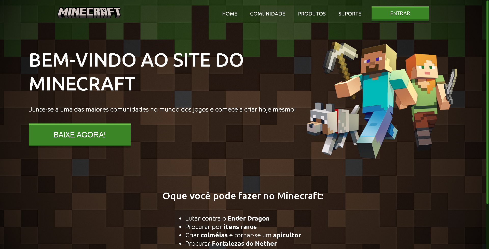
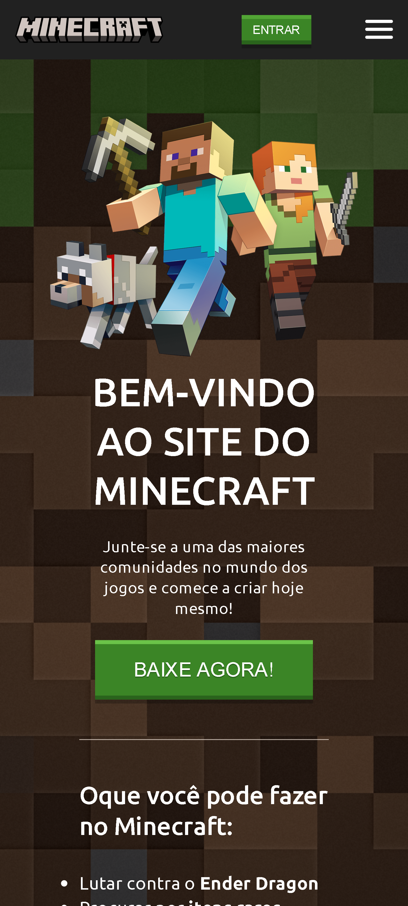

<h1 align="center"> Landing Page de Minecraft </h1> 

### 💻 Projeto 
Um projeto simples de Landing Page com o tema de Minecraft Web Responsivo. 

### ⚙ Funcionalidades
- Projeto responsivo
- Menu de navegação hamburguer
- Scrollbar personalisado

### 🚀 Tecnologias
- HTML
- CSS
- JavaScript
